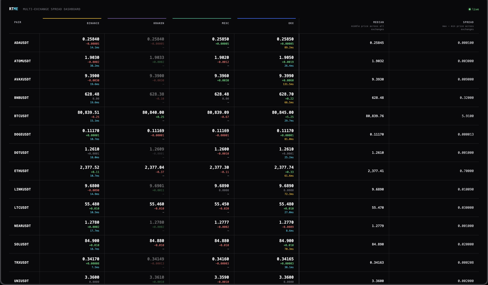
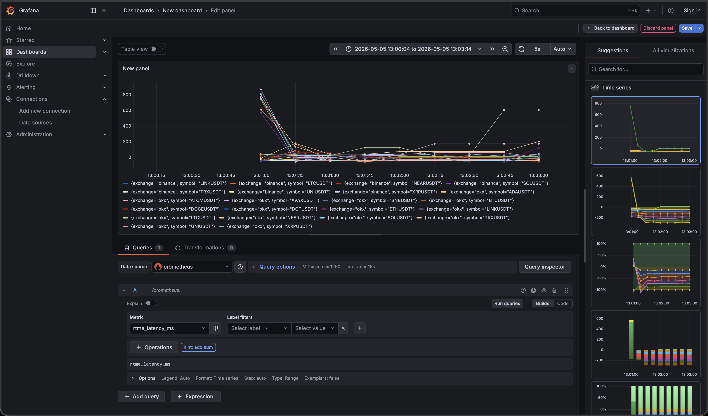
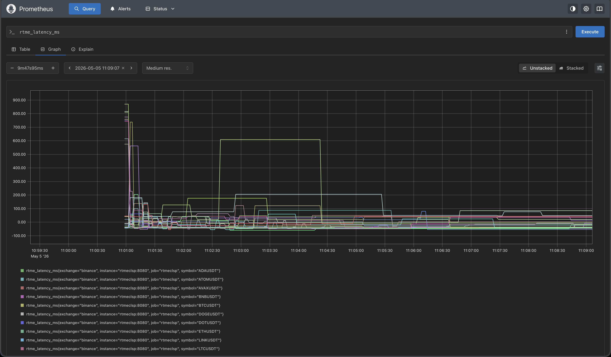

# rtmeclsp

**Real-Time Multi-Exchange Crypto Latency & Spread Monitor**

Live price dashboard that aggregates tickers from Binance, Kraken, MEXC and OKX, computes cross-exchange spread and median, and streams updates to the browser every 500 ms via SSE.

## The Problem
Crypto liquidity is spread across dozens of platforms, each with different latencies and price points. Keeping track of the "global" price and exchange stability usually requires multiple tabs and heavy browser resources. **rtmeclsp** solves this by consolidating the most critical market health metrics into a single, lightweight, and ultra-fast SSE-powered pivot table.

## Why rtmeclsp?
In a fragmented crypto market, price discovery happens at different speeds across exchanges. **rtmeclsp** was built to visualize these micro-inefficiencies in real-time. By aggregating high-frequency data into a single, low-latency dashboard, it allows traders and developers to:
- Spot cross-exchange arbitrage opportunities instantly.
- Monitor exchange-specific latency and "lag" during high volatility.
- Establish a "true" market price using real-time median calculations.

## Motivation
Standard trading interfaces are often bloated or limited to a single exchange. **rtmeclsp** explores the limits of high-throughput data processing in Rust. The goal was to create a "zero-compromise" monitoring tool that handles multiple concurrent WebSocket streams, performs atomic updates using lock-free data structures (`DashMap`), and maintains sub-second synchronization with the frontend—all while keeping resource usage minimal.



---

## Features

- **Live pivot table** — symbols as rows, exchanges as columns; price, diff from median, and latency per cell
- **Flash animations** — cells flash green/red on price change
- **Spread & median** — computed per symbol across all connected exchanges
- **Staleness detection** — cells fade when a feed goes silent (configurable threshold)
- **Exchange status** — tracks Connected / Disconnected / Reconnecting per exchange
- **Price history** — ring-buffer per (exchange, symbol), queryable via REST
- **Prometheus Metrics** — built-in `/metrics` endpoint for latency, price, and spread monitoring
- **Swagger Documentation** — full API spec available at `/docs`
- **Configurable** — symbols and exchanges chosen in `config.yaml`; no recompile needed

---

## Quick start

### Docker (recommended)

The project includes a full monitoring stack (Prometheus + Grafana).

```bash
git clone https://github.com/kezzlock/rtmeclsp
cd rtmeclsp
docker compose up
```

Services:
- **Dashboard**: [http://localhost:8080](http://localhost:8080)
- **Swagger Docs**: [http://localhost:8080/docs](http://localhost:8080/docs)
- **Prometheus**: [http://localhost:9090](http://localhost:9090)
- **Grafana**: [http://localhost:3000](http://localhost:3000) (Anonymous login as Admin)

To change symbols or exchanges, edit `config.yaml` and restart the container.

### Build from source

```bash
cargo build --release
./target/release/rtmeclsp
```

Requires Rust 1.86+.

---

## Monitoring (Prometheus & Grafana)



The application exports the following metrics via `/metrics`:

| Metric | Type | Labels | Description |
|---|---|---|---|
| `rtme_price` | Gauge | `exchange`, `symbol` | Current price from exchange |
| `rtme_latency_ms` | Gauge | `exchange`, `symbol` | Latency (Exchange TS → Server receipt) |
| `rtme_spread` | Gauge | `symbol` | Current spread (Max - Min) across exchanges |

The provided `docker-compose.yaml` starts a pre-configured Prometheus instance that scrapes the app every 5 seconds.



---

## Configuration

```yaml
# config.yaml
http:
  port: 8080

exchanges:
  enabled:
    - binance
    - mexc
    - kraken
    - okx

symbols:
  - BTCUSDT
  - ETHUSDT
  - SOLUSDT
  # … add any symbol supported by all enabled exchanges

websocket:
  reconnect_backoff_ms: 1000   # initial backoff; doubles on each retry, capped at 30 s
  reconnect_max_attempts: 10   # 0 = retry forever

store:
  stale_threshold_ms: 10000    # mark cell stale after this many ms of silence
  history_capacity: 1000       # ring-buffer depth per (exchange, symbol)
```

---

## REST API

| Endpoint | Description |
|---|---|
| `GET /` | Live dashboard (HTML) |
| `GET /docs` | Swagger / OpenAPI Documentation |
| `GET /metrics` | Prometheus Metrics |
| `GET /health` | `{"status":"ok","has_data":bool}` |
| `GET /snapshot` | Current prices for all symbols (JSON) |
| `GET /snapshot?symbols=BTCUSDT,ETHUSDT` | Filtered snapshot |
| `GET /exchanges` | Exchange connection statuses |
| `GET /history?symbol=BTCUSDT&limit=100` | Price history (newest first) |
| `GET /events` | SSE stream — emits `snapshot` event every 500 ms |

---

## Architecture

```
config.yaml
    │
    ▼
main.rs ──► tokio::spawn × N exchanges
                │
                ├── BinanceAdapter  ─┐
                ├── KrakenAdapter   ─┤─ WsAdapter trait ──► run_ws_feed()
                ├── OkxAdapter      ─┘
                └── mexc_client (REST polling, 1 req/s)
                         │
                         ▼
                  SharedSnapshotStore (DashMap)
                  + metrics emission
                         │
                         ▼
                  axum HTTP server
                  ├── GET /snapshot, /history, /exchanges
                  ├── GET /metrics (Prometheus)
                  └── GET /events  (SSE, 500 ms interval)
                             │
                             ▼
                       Browser (SSE + JS pivot table)
```

**Key design decisions:**

- `DashMap` instead of `RwLock<HashMap>` — lock-free concurrent reads from many WS tasks
- `WsAdapter` trait — adding a new exchange requires only a parser struct; reconnect/backoff logic is shared
- MEXC uses REST polling (their WebSocket requires authentication and is geographically blocked for public data)
- `Decimal` for prices — high-precision arithmetic for spread and median calculations

---

## License

MIT
